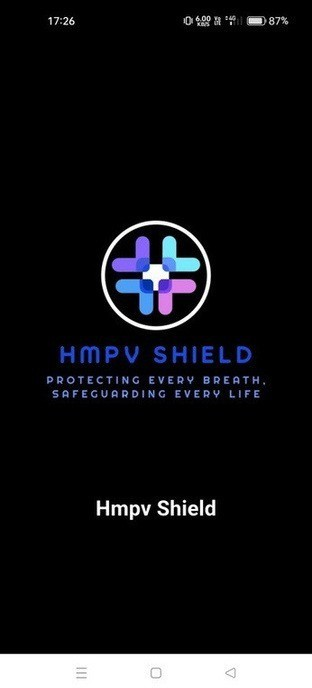
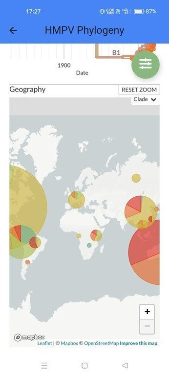
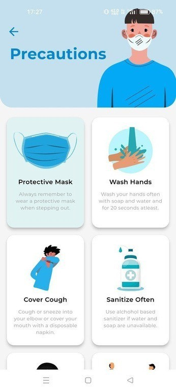
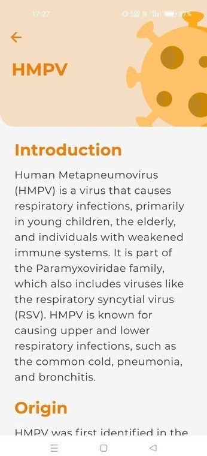
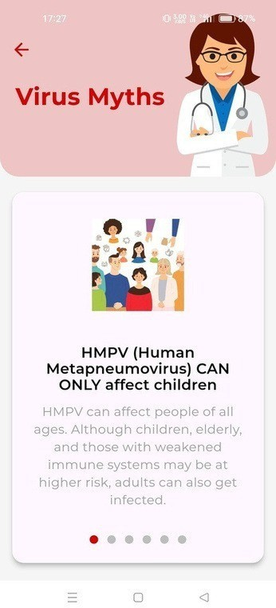

# 🛡️ HMPV Shield(HMPV RISK IDENTIFICATION AND ADVICE SYSTEM)

**HMPV Shield** is a Flutter-based Android app developed as an MCA final year project. It spreads awareness about **Human Metapneumovirus (HMPV)** and provides health tools such as symptom checking, nearby hospital lookup, and real-time news updates.

---

## 📱 App Features

- 🧬 **Splash Screen** – Smooth app launch experience.
- 🏠 **Dashboard** – Quick access to all features.
- 🔬 **Phylogeny** – Understand the viral lineage and evolution.
- 🩹 **Precautions** – Tips to stay safe from HMPV.
- 🩺 **Symptom Checker** – Input symptoms and assess risk level.
- 📰 **Real-Time News** – Health-related news via NewsAPI.
- 📚 **Virus Info** – Learn about HMPV in detail.
- 🚨 **Risk Assessment** – Get categorized risk levels (e.g., High Risk).
- ❓ **Myths** – Bust common misconceptions.
- ℹ️ **About App** – Overview of the app’s purpose.
- 🎖️ **Rating & Credits Menu** – Rate the app or view developers.
- ⭐ **Rate App** – Share your feedback and rating.

---

## 📷 App Screenshots

| Feature | Screenshot |
|--------|-------------|
| 1. Splash Screen |  |
| 2. Dashboard |  |
| 3. Phylogeny |  |
| 4. Precautions |  |
| 5. Symptom Checker |  |
| 6. News / Updates |  |
| 7. Virus Info |  |
| 8. Risk Assessment Result |  |
| 9. Myths Debunked |  |
| 10. About App |  |
| 11. Rating & Credits Menu |  |
| 12. Rate Us Page |  |

---

## 📄 Project Documents

- 📘 [Project Report](Project_Report.pdf)
- 🎞️ [Project Presentation](Project_Presentation.pptx)

---

## 🚀 Technologies Used

- **Flutter** & **Dart**
- **Firebase**
- **Google Maps API**
- **NewsAPI**
- **Material Design Components**

---

## 🙌 Acknowledgements

- Developed as part of MCA Final Year Project  
- Special thanks to faculty and mentors at *[Your College Name]*

---

## 📬 Contact

**Developer:** Ram Kumar  
📧 Email: [your-email@example.com]  
📍 Location: Arikarevula, East Godavari

---
